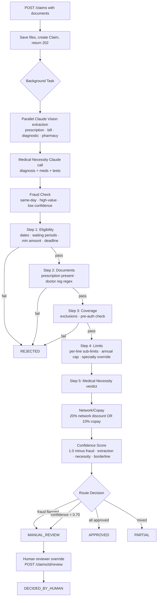

# OPD Claim Adjudication Tool

AI-powered system for adjudicating (approve/reject) Outpatient Department insurance claims. Combines rule-based policy logic with Claude multimodal vision for document extraction.

## Architecture

```
┌─────────────────────────────────────────────────────────────┐
│  Frontend (Next.js 14 + shadcn/ui)          Vercel          │
│  Claims Dashboard | Submit | Detail | Eval | Policy         │
└───────────────────────┬─────────────────────────────────────┘
                        │ REST API
┌───────────────────────▼─────────────────────────────────────┐
│  Backend (FastAPI + SQLAlchemy + SQLite)     Railway         │
│                                                              │
│  POST /claims ──► BackgroundTasks                           │
│                        │                                     │
│            ┌───────────▼───────────┐                        │
│            │   Extraction Service  │  Claude Vision API      │
│            │ (asyncio.gather 4 calls)                        │
│            └───────────┬───────────┘                        │
│                        │                                     │
│            ┌───────────▼───────────┐                        │
│            │  Adjudication Pipeline│                         │
│            │  Step 1: Eligibility  │ date math + wait periods│
│            │  Step 2: Documents    │ regex + field checks    │
│            │  Step 3: Coverage     │ exclusions + pre-auth   │
│            │  Step 4: Limits       │ sub-limits + per-claim  │
│            │  Step 5: Med Necessity│ Claude reasoning call   │
│            └───────────┬───────────┘                        │
│                        │                                     │
│            Decision: APPROVED/REJECTED/PARTIAL/MANUAL_REVIEW│
└─────────────────────────────────────────────────────────────┘
```

## Decision Logic Flowchart



## Project Resources

Assignment artifacts and reference docs live in `backend/data/`:

| File | Purpose |
|------|---------|
| `policy_terms.json` | Active policy (auto-seeded into DB on first startup) |
| `adjudication_rules.md` | Source of truth for decision logic — `services/adjudication.py` mirrors this |
| `test_cases.json` | TC001–TC010 evaluation suite, run via `/admin/eval` or `POST /eval/adjudication` |
| `sample_documents_guide.md` | Sample medical documents reference for manual testing |

## Quick Start

### Backend
```bash
cd backend
cp .env.example .env
# Edit .env: add ANTHROPIC_API_KEY=sk-ant-...

pip install uv
uv venv .venv
uv pip install -r pyproject.toml
.venv/Scripts/activate  # Windows
uvicorn app.main:app --reload --port 8001
```

### Frontend
```bash
cd frontend
cp .env.example .env.local
# Edit .env.local: NEXT_PUBLIC_API_URL=http://localhost:8001

npm install
npm run dev
```

Open http://localhost:3000

## Evaluation

The system achieves **100% decision accuracy** on all 10 test cases:

| Case | Scenario | Expected | Result |
|------|----------|----------|--------|
| TC001 | Simple consultation | APPROVED ₹1,350 | ✓ |
| TC002 | Dental partial (root canal + whitening) | PARTIAL ₹8,000 | ✓ |
| TC003 | Claim exceeds per-claim limit | REJECTED | ✓ |
| TC004 | Missing prescription | REJECTED | ✓ |
| TC005 | Diabetes in waiting period | REJECTED | ✓ |
| TC006 | Ayurvedic treatment | APPROVED ₹4,000 | ✓ |
| TC007 | MRI without pre-auth | REJECTED | ✓ |
| TC008 | Multiple same-day claims (fraud) | MANUAL_REVIEW | ✓ |
| TC009 | Weight loss (excluded) | REJECTED | ✓ |
| TC010 | Apollo network cashless | APPROVED ₹3,600 | ✓ |

Run in-browser: `/admin/eval` → "Run Evaluation"

## Key Design Decisions

### Why no RAG?
The policy document fits in a single Claude context window. RAG adds retrieval overhead without accuracy benefit for a known-size policy. Listed as a future enhancement.

### Async strategy
`POST /claims` returns immediately. Extraction + adjudication runs in FastAPI `BackgroundTasks`. Vision calls are parallelized via `asyncio.gather`. Frontend polls every 2.5s. No Redis/Celery required for MVP.

### Per-claim limit vs sub-limits
- Specialty categories (dental/vision/alternative_medicine) use their sub_limit as the binding cap
- Non-specialty claims (consultation + pharmacy) are subject to the ₹5,000 per-claim limit
- This resolves TC002 (dental ₹8,000 approved) vs TC003 (general ₹7,500 rejected)

### Network vs copay
- Network hospital → 20% flat discount, copay suppressed
- Non-network with consultation → 10% copay on eligible total
- No copay when specialty category drives the claim

### Fraud handling
Fraud indicators (multiple same-day claims, high value, low extraction confidence) → `MANUAL_REVIEW` — never auto-REJECT. Humans review borderline cases.

## Assumptions

1. `submission_date` defaults to `treatment_date` when not provided
2. `member_join_date` defaults to `policy.effective_date` (2024-01-01) when not in member record
3. Pre-authorization is required for tests marked `(with pre-auth)` in `covered_tests` — no ₹ threshold
4. Network discount applies to the full eligible total, not just consultation
5. Copay is 10% of full eligible total whenever a consultation item is present (and no specialty category)
6. Sub-limit YTD is computed on-the-fly from approved decisions — no separate counter

## Deployment

### Railway (backend)
1. Create Railway project, add service from GitHub repo (root: `backend/`)
2. Set env vars: `ANTHROPIC_API_KEY`, `DATABASE_URL=sqlite:///./opd_claims.db`, `UPLOAD_DIR=./uploads`
3. Expose port 8000, set start command: `uvicorn app.main:app --host 0.0.0.0 --port 8000`
4. Mount a volume for `/app/uploads` and `/app/opd_claims.db`

### Vercel (frontend)
1. Import GitHub repo, set root directory to `frontend/`
2. Set env var: `NEXT_PUBLIC_API_URL=https://your-railway-app.railway.app`
3. Deploy

## API Reference

| Method | Endpoint | Description |
|--------|----------|-------------|
| GET | `/health` | Health check |
| GET | `/policy` | Active policy JSON |
| PUT | `/policy` | Replace active policy payload (admin) |
| GET | `/members` | All covered members |
| POST | `/claims` | Submit claim (multipart) |
| GET | `/claims` | List claims (optional ?status=) |
| GET | `/claims/{id}` | Claim detail with decision |
| POST | `/claims/{id}/review` | Manual review override |
| POST | `/eval/adjudication` | Run test_cases.json evaluation |
